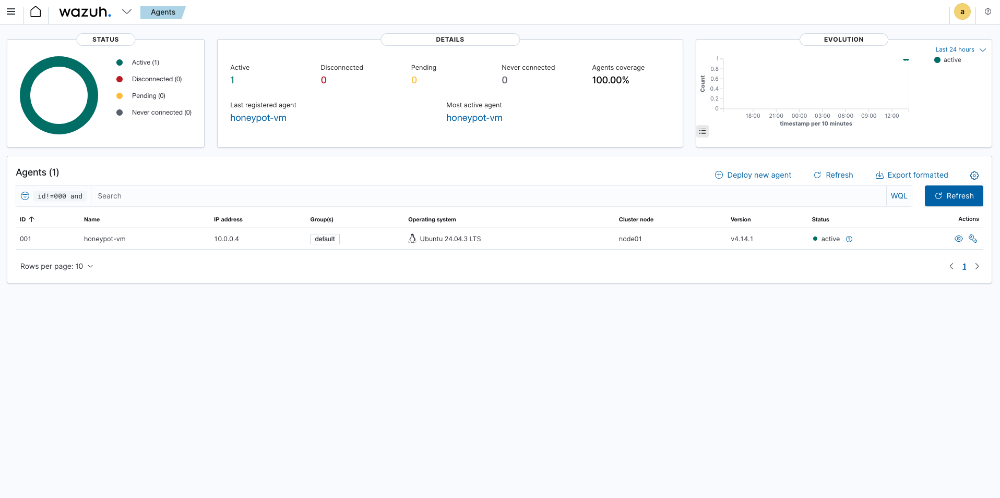
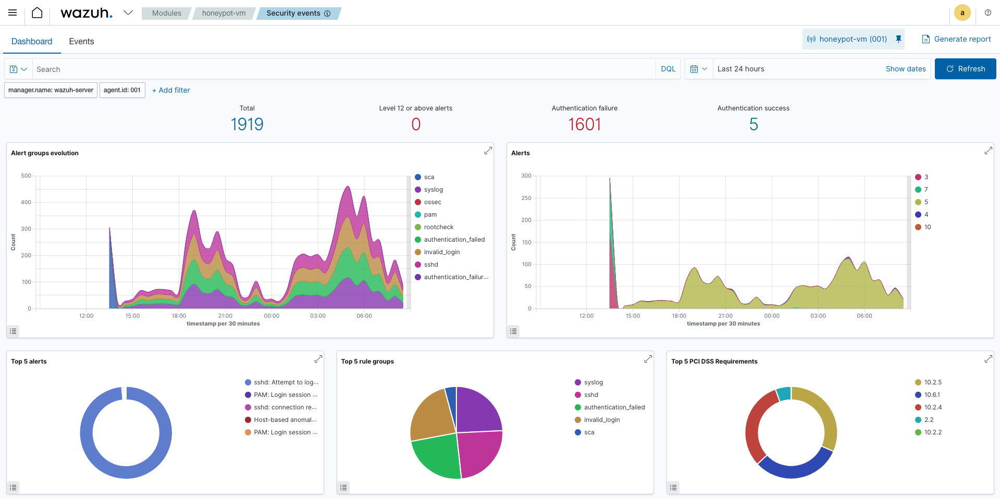
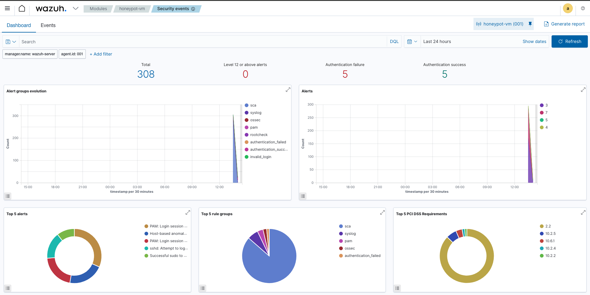
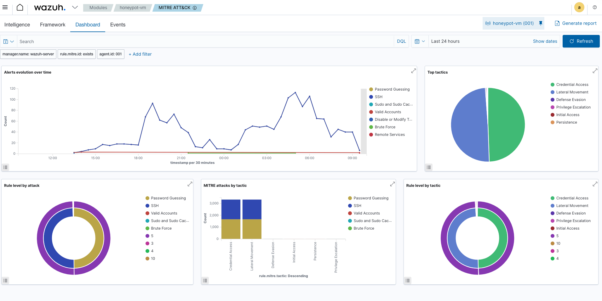
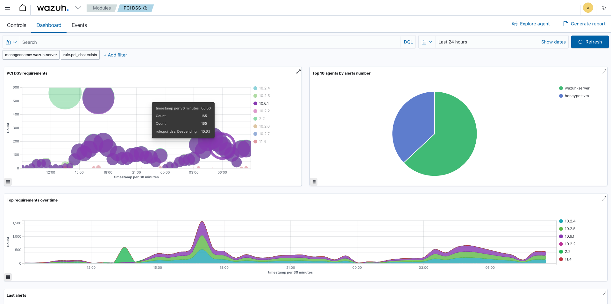

# Azure-Cloud-Honeypot-Live-Threat-Detection1`	
Cloud Security Monitoring Project: Deployed Azure honeypot and captured 2900+ real-world attacks using Wazuh SIEM.
# Azure Cloud Honeypot: Live Threat Detection & SIEM Analysis


Deployed an intentionally vulnerable honeypot in Microsoft Azure and captured **2,953 real-world cyber attacks** in 24 hours using Wazuh SIEM.

---

## Project Overview

This project demonstrates cloud security monitoring by deploying a honeypot to attract real-world attacks, analyzing threat patterns with Wazuh SIEM, and mapping findings to industry frameworks (MITRE ATT&CK, PCI DSS).

**Key Achievement:** Captured 2,953 SSH brute-force attacks within 24 hours, with techniques matching nation-state APT groups.

---

##  Results at a Glance

| Metric | Result |
|--------|--------|
| **Total Attacks Captured** | 2,953 |
| **Time to First Attack** | <5 minutes |
| **Peak Attack Rate** | 165 per 30 minutes |
| **Attack Type** | SSH brute-force |
| **Threat Intelligence** | Matched APT1, Andariel patterns |

---

## ️ Architecture
```
Internet → Honeypot (SSH:22 Open) → Wazuh Agent → Wazuh SIEM → Security Dashboard
```

**Components:**
- **Honeypot VM:** Ubuntu 24.04, exposed SSH port
- **Wazuh Server:** SIEM for real-time monitoring
- **Azure Infrastructure:** VMs, VNets, NSGs

**[View Full Architecture →](docs/architecture-diagram.md)**

---

##  Documentation

**Complete guides and analysis:**
- **[Setup Guide](docs/setup-guide.md)** - Step-by-step deployment instructions
- **[Security Analysis Report](docs/security-analysis-report.md)** - Comprehensive threat analysis and findings
- **[Architecture Diagram](docs/architecture-diagram.md)** - System design and data flow

---

##  Screenshots

### Wazuh Dashboard - Active Monitoring



### Attack Events Timeline


### MITRE ATT&CK Threat Mapping


### PCI DSS Compliance Violations



### NIST 800-53 Compliance Requirements


*Additional screenshots available in `/screenshots` directory*

---

## ️ Technologies Used

- **Cloud:** Microsoft Azure (VMs, VNets, NSGs)
- **SIEM:** Wazuh 4.14.1
- **OS:** Ubuntu Server 24.04 LTS
- **Frameworks:** MITRE ATT&CK, PCI DSS

---

##  Key Findings

### Attack Analysis:
-  100% automated attacks (no human interaction)
-  Global sources (Asia-Pacific, Eastern Europe, South America)
-  Common usernames targeted: `root`, `admin`, `user`, `test`
-  Techniques matched APT1, Andariel, Ajax Security Team

### MITRE ATT&CK Techniques:
- **T1110.001** - Brute Force: Password Guessing
- **T1021.004** - Remote Services: SSH
- **T1078** - Valid Accounts

### PCI DSS Violations:
- **10.2.4** - Invalid access attempts (2,953 events)
- **10.2.5** - Authentication mechanism use (2,953 events)

---

##  Skills Demonstrated

**Technical:**
- Cloud infrastructure deployment (Azure)
- SIEM configuration and management
- Network security (firewalls, NSGs)
- Security log analysis
- Threat intelligence analysis

**Analytical:**
- Attack pattern recognition
- Compliance framework mapping
- Risk assessment
- Incident documentation

---

##  Quick Start

### Prerequisites:
- Azure account
- Basic Linux knowledge
- SSH client

### Setup:
1. Follow **[Setup Guide](docs/setup-guide.md)**
2. Deploy Azure infrastructure
3. Install Wazuh SIEM
4. Expose honeypot
5. Monitor attacks

**Time:** 2-4 hours | **Cost:** ~$20-50/month

---

##  Key Takeaways

1. **Speed of Attack** - Systems are attacked within hours of exposure
2. **Attack Volume** - Even small systems face thousands of daily attempts
3. **Automation** - 100% of attacks were automated bots
4. **SIEM Value** - Real-time monitoring is essential for visibility
5. **Security Controls** - MFA, rate limiting, and access restrictions are critical

---

##  Recommendations

**Immediate Actions:**
- Implement multi-factor authentication
- Use SSH key authentication only
- Restrict access to known IP ranges
- Deploy fail2ban or similar tools

**Full recommendations in [Security Analysis Report →](docs/security-analysis-report.md)**

---

##  Resources

- [Wazuh Documentation](https://documentation.wazuh.com/)
- [MITRE ATT&CK Framework](https://attack.mitre.org/)
- [PCI DSS Standards](https://www.pcisecuritystandards.org/)
- [Azure Security Best Practices](https://docs.microsoft.com/azure/security/)

---

## ️ Disclaimer

This project was conducted in an isolated environment for educational purposes only. The honeypot was intentionally configured with weak security. **Do not replicate in production.**

All IP addresses have been sanitized. Systems were deleted after project completion.

---

##  Author

**Hope Jennifer**

- LinkedIn: www.linkedin.com/in/jennifer-hope-8731a9184
- Email: hopejennifer167@gmail.com

---

##  License

MIT License - See [LICENSE](LICENSE) for details

---

** Star this repo if you found it helpful!**

*Cloud Security | SIEM | Threat Intelligence | Azure | Wazuh | Honeypot*
